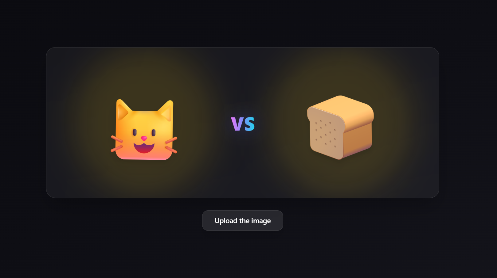

# Cat or Loaf — Image Classifier (FastAPI + React)

A tiny full‑stack app with a dark, animated, emoji‑forward UI that predicts **cat 🐱** vs **loaf 🍞** using a trained Keras `.h5` model.

> Preview 

---

## Features

* ⚡ **FastAPI** backend with a single image‑classification endpoint
* 🖼️ Drag‑and‑drop **React + Vite** frontend
* 📦 **Docker Compose** for one‑command local setup
* 🧠 Keras `.h5` model loaded from `backend/static/models/cat_or_loaf.h5`
* 🔒 CORS enabled for local dev; configurable API URL via `.env.local`

## Tech Stack

* **Backend:** Python, FastAPI, Uvicorn
* **ML:** TensorFlow/Keras (`.h5` model)
* **Frontend:** React, Vite
* **Containerization:** Docker & Docker Compose

---

## Quick Start

### Option A) Docker (recommended)

```bash
# from repo root
docker compose up --build
# frontend → http://localhost:5173
# backend  → http://localhost:8000
```

### Option B) Local development

#### Backend

```bash
cd backend
python -m venv .venv && source .venv/bin/activate   # Windows: .venv\Scripts\activate
pip install -r requirements.txt
uvicorn main:app --reload --port 8000
```

> Model file expected at: `backend/static/models/cat_or_loaf.h5`

#### Frontend

Set API URL (optional):

```ini
# frontend/.env.local
VITE_API_URL=http://localhost:8000
```

Install & run:

```bash
cd frontend
npm i
npm run dev   # opens http://localhost:5173
```

---

## API Reference

### POST `/`

Classify an image as `cat` or `loaf`.

**Request**

* Content type: `multipart/form-data`
* Form field: `file` (the image)

**cURL**

```bash
curl -X POST \
  -F "file=@/path/to/image.jpg" \
  http://localhost:8000/
```

**JavaScript (fetch)**

```js
const form = new FormData();
form.append("file", fileInput.files[0]);
const res = await fetch("http://localhost:8000/", { method: "POST", body: form });
const data = await res.json();
// { label: "cat" | "loaf", confidence: 0-100 }
```

**Response (200)**

```json
{
  "label": "loaf",
  "confidence": 93.4
}
```

---

## Model, Dataset & Training

* **Model path:** `backend/static/models/cat_or_loaf.h5`
* **Dataset:** [https://www.kaggle.com/datasets/erogluegemen/cat-catloaf-classification](https://www.kaggle.com/datasets/erogluegemen/cat-catloaf-classification)
* **Colab notebook:** [https://colab.research.google.com/drive/1uO1OKzKWYO7HLM5wwAA2CEjCUuX7K3\_5?usp=sharing](https://colab.research.google.com/drive/1uO1OKzKWYO7HLM5wwAA2CEjCUuX7K3_5?usp=sharing)

If you retrain the model, export a compatible `.h5` and place it at the path above.

---

## Development Notes

* Ensure your Python and Node versions align with your dependencies (e.g., Python 3.10+, Node 18+ recommended).
* If the backend can’t find the model, double‑check the relative path and that the file is included in your Docker image.
* Large images may affect latency; resizing on the client before upload can help.

---


## License

MIT. See `LICENSE`.

## Acknowledgments

* Dataset by Egemen Eroglu on Kaggle (linked above).
* Built with FastAPI, React and an unreasonable love for baked goods.
